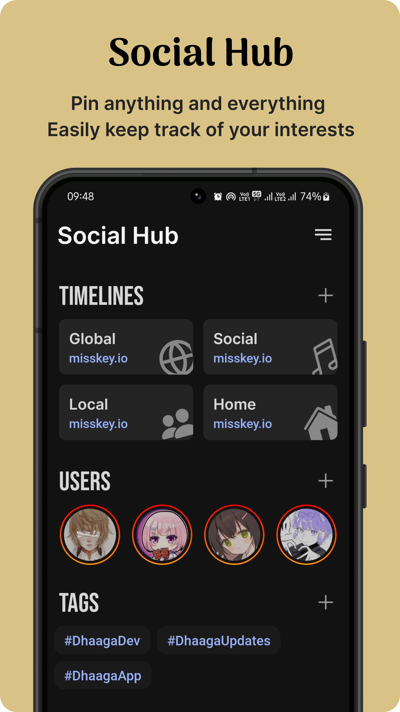
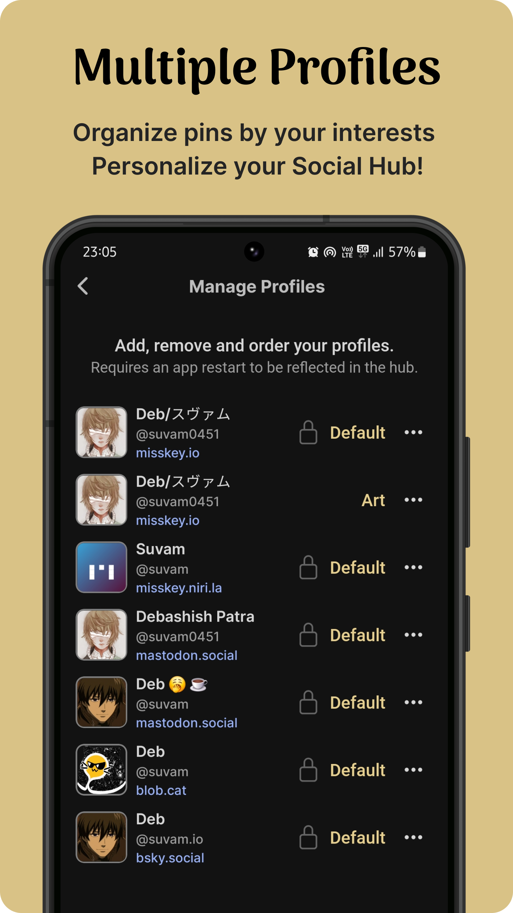
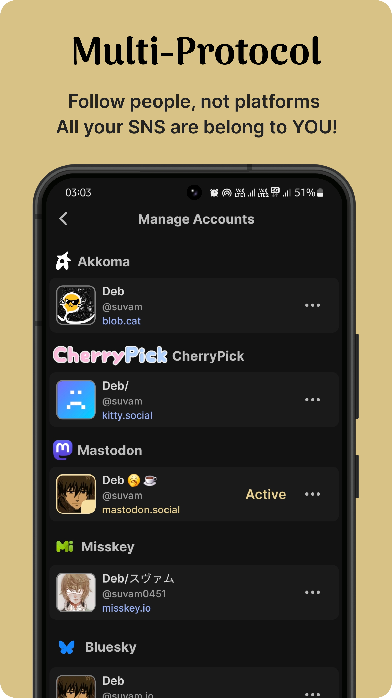
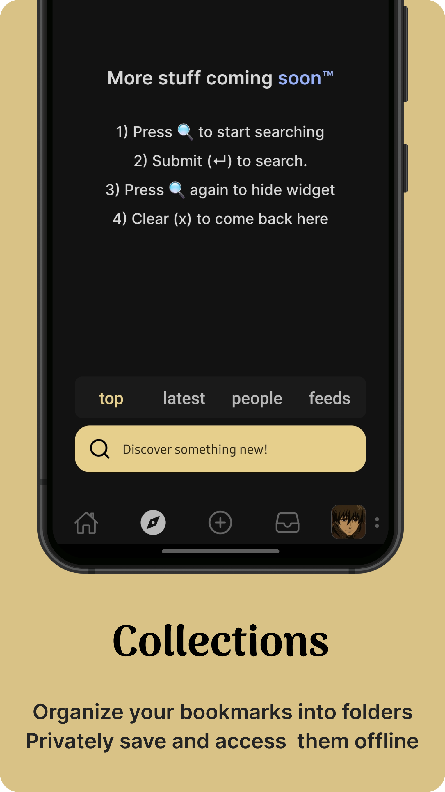

<h3 align="center">Hi, I am Debashish 👋</h3>

  <a href="https://suvam.io">Website</a> •
  <a href="https://suvam.io">Apps</a> •
  <a href="https://discord.gg/kMp5JA9jwD">Discord</a> •
  <a href="https://suvam.io/blog">Blog</a> •
  <a href="https://suvam.io/about">About</a> •
  <a href="https://suvam.io/sponsor">Sponsor</a>

<h1 align="center">Dhaaga (धागा)</h1>

  <h3 align="center">SNS client for Bluesky, Mastodon and Misskey</h3>

  
  
  
  

&nbsp;

  💅 Sleek and Stylish •
  ⚡ Fast •
  🥳 Fun Add-Ons • 
  🦉 Dark Theme •
  ✌️ One-Handed Mode

  
  &nbsp;
  

